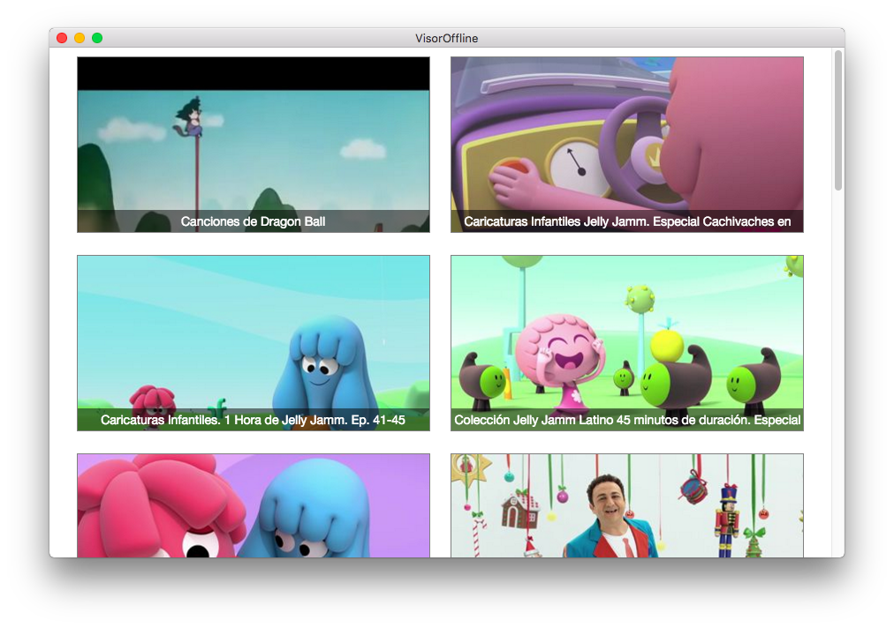

# visor-offline

Una aplicación sencilla para reproducir videos de forma offline:

Para descargar las versiones compiladas podrías ir a la sección releases:

* https://github.com/hugoruscitti/visor-offline/releases
